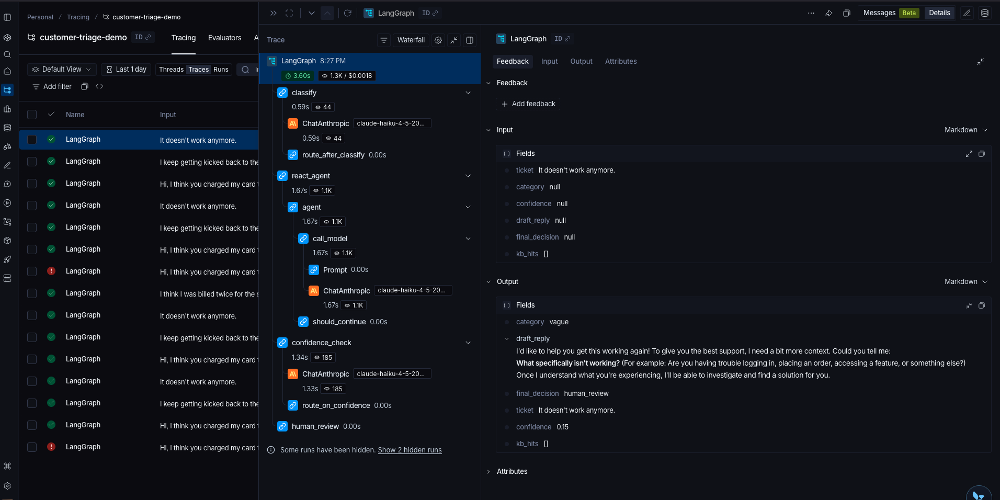

# Customer Support Triage Agent (LangGraph + LangSmith + Chroma RAG + ReAct)

A small, end-to-end LangGraph agent that triages an inbound customer-support message: classifies it, takes one of two paths depending on the category (RAG retrieval for well-scoped tickets, a ReAct sub-agent with tool use for vague ones), drafts a reply, checks its own confidence, and escalates to a human if it isn't sure.

Built as a working reference for what production-shape agentic workflows look like with the LangChain stack. Every node — and every tool call inside the ReAct loop — emits LangSmith traces so the full decision path is observable.

## Live demo

**▶ Try it live: https://&lt;your-app&gt;.streamlit.app** *(hosted free on Streamlit Community Cloud)*

Paste a support ticket — or pick a sample — and watch it route through the graph node by node: classify → retrieve (Chroma RAG) / ReAct → draft → confidence → auto-send or human review. The same graph in `src/` runs behind a small Streamlit UI in `streamlit_app.py`.

## What this shows

- **LangGraph for orchestration** — a `StateGraph` with branching logic. Failure modes (and category-specific behavior) are explicit nodes, not exceptions or `if` statements buried inside one big function.
- **Chroma vector store for RAG** — semantic retrieval over a small knowledge base, filtered by ticket category at query time. The `search()` interface used to be keyword-based; swapping to a vector backend did not require any change to the graph.
- **ReAct sub-agent for vague tickets** — built with `langgraph.prebuilt.create_react_agent`. When the classifier returns `vague`, the agent enters a Reason → Act → Observe loop over three tools (system status, customer activity lookup, unrestricted KB search) before drafting a reply.
- **Tool use via the Claude API** through `langchain-anthropic`.
- **LangSmith observability** — every run produces a full trace tree with inputs, outputs, latency, and token counts per node. ReAct tool calls appear as nested spans, so you can audit the agent's reasoning step by step.
- **Simple state model** — `TypedDict` state passes through the graph, mutated by each node.
- **Tested with three sample tickets** — billing (RAG path), technical (RAG path), vague (ReAct path).

## Why this design

Real production agents fail in legible ways. A graph with named nodes (rather than a single LLM call wrapped in retries) makes failure isolatable: you can see which node returned low confidence, retry just that node, swap models per node, or add a human-in-the-loop step exactly where it's needed.

The shape is the same one used in most production AI tooling I've shipped: small, named, observable steps you can reason about one at a time.

## Run it

```bash
# 1. Install
python -m venv .venv && source .venv/bin/activate
pip install -r requirements.txt

# 2. Set keys
cp .env.example .env
# Edit .env and fill in:
#   ANTHROPIC_API_KEY=sk-ant-...
#   LANGSMITH_API_KEY=ls__...   (free tier at https://smith.langchain.com)
#   LANGSMITH_PROJECT=customer-triage-demo

# 3. Run
python src/triage_agent.py

# Or pass your own ticket
python src/triage_agent.py "My card was charged twice last Tuesday"
```

You'll see the agent's decisions printed in the terminal, and full traces in your LangSmith project view.

### Or run the web UI locally

```bash
streamlit run streamlit_app.py
```

## Deploy it yourself (Streamlit Community Cloud)

The web UI deploys free from this repo — no Dockerfile, no server to manage:

1. Make sure this repo is pushed to GitHub (it's public at the URL above).
2. Go to [share.streamlit.io](https://share.streamlit.io) → **Create app** → pick this repo, branch `master`, main file `streamlit_app.py`.
3. Under **Advanced settings → Secrets**, paste your keys in TOML form (template in `.streamlit/secrets.toml.example`):
   ```toml
   ANTHROPIC_API_KEY = "sk-ant-..."
   # optional — turns on LangSmith tracing of every run
   LANGSMITH_TRACING = "true"
   LANGSMITH_API_KEY = "lsv2_..."
   LANGSMITH_PROJECT = "customer-triage-demo"
   ```
4. **Deploy.** First boot downloads the Chroma embedding model (~80 MB), so the very first run takes a few extra seconds; it's cached after that.

> The app makes live Claude API calls, so it caps runs per browser session. For a public link, set a spend limit on your Anthropic key as the real backstop.

## Files

- `streamlit_app.py` — the web UI (deployed to Streamlit Community Cloud)
- `src/triage_agent.py` — the full graph (≈140 lines)
- `src/knowledge_base.py` — knowledge base + Chroma semantic retrieval
- `src/tools.py` — tools the ReAct sub-agent can call
- `requirements.txt`
- `.env.example`

## Architecture

```
                 ┌─────────────┐
        ticket → │  classify   │  (billing | technical | vague)
                 └──────┬──────┘
                        │
        ┌───────────────┴───────────────┐
   (billing/                          (vague)
    technical)                          │
        │                               ▼
        ▼                       ┌───────────────┐
┌──────────────┐                │  react_agent  │  ReAct loop:
│   retrieve   │                │  - thought    │   thought → tool call →
└──────┬───────┘                │  - tool call  │   observation → ... →
       ▼                        │  - observation│   final answer
┌──────────────┐                │  - repeat ... │
│     draft    │                └───────┬───────┘
└──────┬───────┘                        │
       │                                │
       └──────────────┬─────────────────┘
                      ▼
              ┌───────────────┐
              │  confidence_  │
              │     check     │
              └──┬─────────┬──┘
          high   │         │  low
                 ▼         ▼
             ┌──────┐   ┌──────────────┐
             │ done │   │ human_review │
             └──────┘   └──────────────┘
```

### Tools available to the ReAct sub-agent

| Tool | What it returns (stubbed for the demo) |
|---|---|
| `get_recent_system_status()` | Whether any services have had recent issues |
| `get_customer_recent_activity(user_id)` | Mock recent orders / logins / errors for a user |
| `search_knowledge_base(query)` | Semantic KB search, unrestricted by category |

These are stubs that return canned data. In a real deployment, each function body would call a real API (status page, customer-data service, production KB). The shape doesn't change.

## Sample LangSmith Trace

Every run produces a full trace tree in LangSmith — inputs, outputs, latency, and token count per node.



In the screenshot above, you can see the full path for one billing ticket as it flowed through the graph: `classify → retrieve → draft → confidence_check → human_review`. Each node is its own span with its own latency and cost, and each `ChatAnthropic` call is nested under its parent node. The draft generated successfully, but the confidence node graded it below the 0.7 threshold, so the graph correctly escalated to human review rather than auto-send a low-confidence reply — exactly the safety behavior this design is built for. High-confidence runs branch to `done` instead, and that path is just as visible.

> **To capture your own trace:** run the demo with `LANGSMITH_TRACING=true` in `.env`, then open https://smith.langchain.com → the `customer-triage-demo` project → click any run → expand the trace tree → take a screenshot and save it as `docs/langsmith-trace.png` (replacing the placeholder).

## Next steps (would-be features for a real deployment)

- ✅ ~~Swap the in-memory KB for a real vector store~~ — done. Chroma with sentence-transformer embeddings, filtered by category metadata.
- ✅ ~~Add a ReAct-style sub-agent for vague tickets~~ — done. `langgraph.prebuilt.create_react_agent` with three stubbed tools, branched off the `classify` node.
- Persist the Chroma collection on disk (currently in-memory and rebuilt per process).
- Replace the mocked tool stubs with real API calls (status page, customer-data service).
- Replace classification with a fine-tuned smaller model for cost.
- Add per-node retries with backoff.
- Wire `human_review` to a Slack channel via tool-calling.
- Add evals: golden-set of tickets, scored by an LLM-judge in LangSmith.
- ✅ ~~Deploy as a hosted demo~~ — done. Streamlit Community Cloud, web UI in `streamlit_app.py`.
